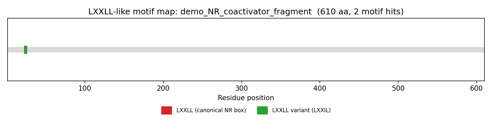

# LXXLL Motif Finder

A command-line tool for detecting **LXXLL-like nuclear-receptor-interaction motifs** (the "NR box" and its known variants) in protein sequences. Built as a follow-up tool to the research paper *"Conserved LXXLL-like Motifs in Viral Proteins as Potential Interactors of Host Nuclear Receptors: Protein-Virus-Cancer Connections."*

LXXLL motifs (where L = leucine and X = any amino acid) are short peptide sequences that mediate protein-protein interactions between coactivators/corepressors and nuclear hormone receptors. Certain viral proteins carry LXXLL-like motifs that may let them hijack this same host signaling machinery — which is the biological question this tool helps explore.

## What it does

- Scans a protein sequence (or many, via FASTA) for the canonical `LXXLL` motif plus common variants (`FXXLF`, `LXXIL`, `LXXML`, `LXXHL`)
- Reports every match with its exact position in the sequence, including overlapping matches
- Can fetch a sequence directly from **UniProt** by accession number
- Exports a clean CSV report
- Generates a PNG map showing where motifs sit along the protein

## Setup

```bash
pip install requests matplotlib biopython
```

## Usage

**Scan a single sequence directly:**
```bash
python motif_finder.py --sequence "MEEPQSDPSVEPPLSQETFSDLWKLLPENNVLSPLPSQAMDDLM"
```

**Scan a FASTA file (single or multiple sequences):**
```bash
python motif_finder.py --fasta my_proteins.fasta --plot
```

**Fetch and scan directly from UniProt by accession number:**
```bash
python motif_finder.py --uniprot P03126 --plot
```

**Custom output path:**
```bash
python motif_finder.py --fasta my_proteins.fasta --out results.csv
```

## Output

- A CSV report (`motif_report.csv` by default) with columns: `Protein ID, Motif Type, Matched Sequence, Start, End`
- If `--plot` is passed, a PNG image mapping motif positions along the first sequence in the input

## Try it with the included demo data

```bash
python motif_finder.py --fasta example_sequences.fasta --plot
```

`example_sequences.fasta` includes:
- A fragment resembling a known nuclear receptor coactivator (contains a canonical LXXLL motif)
- A synthetic "candidate viral" sequence with several overlapping LXXLL-like motifs
- A control sequence with no motifs, to confirm the tool correctly reports zero hits

## Motif patterns detected

| Name | Pattern | Notes |
|---|---|---|
| LXXLL (canonical NR box) | `L..LL` | The classic nuclear receptor box motif |
| FXXLF | `F..LF` | Common in androgen receptor interactions |
| LXXLL variant | `L..[IL]L` | Isoleucine/leucine substitution variant |
| LXXML | `L..ML` | Methionine variant |
| LXXHL | `L..HL` | Histidine variant |

## Example Output



## Limitations / notes for future work

- Regex-based motif matching finds **sequence pattern matches only** — it does not predict binding affinity, structural context, or whether a motif is actually surface-exposed/functional. Any hits should be treated as candidates for further structural or experimental validation, not confirmed interactors.
- UniProt fetching requires an internet connection.
- Possible extensions: batch-plotting for all sequences in a FASTA file, structural context filtering (e.g. cross-referencing with AlphaFold predicted secondary structure to flag motifs likely to be in exposed helices), or a simple web front-end.
